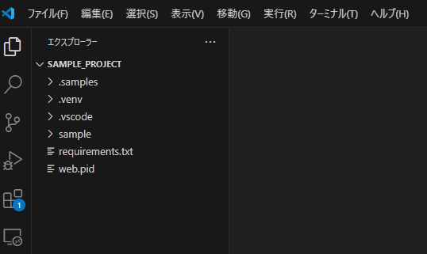
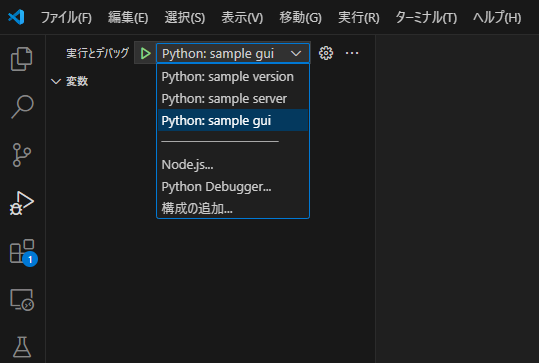
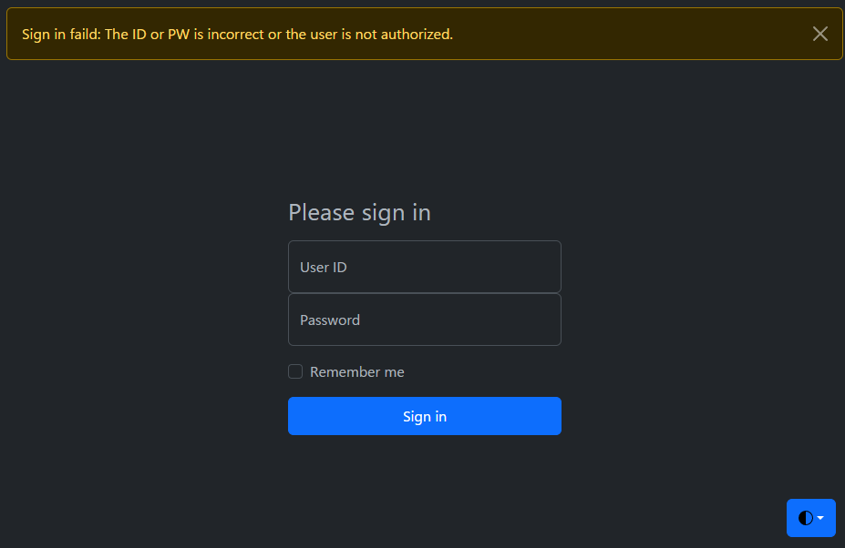
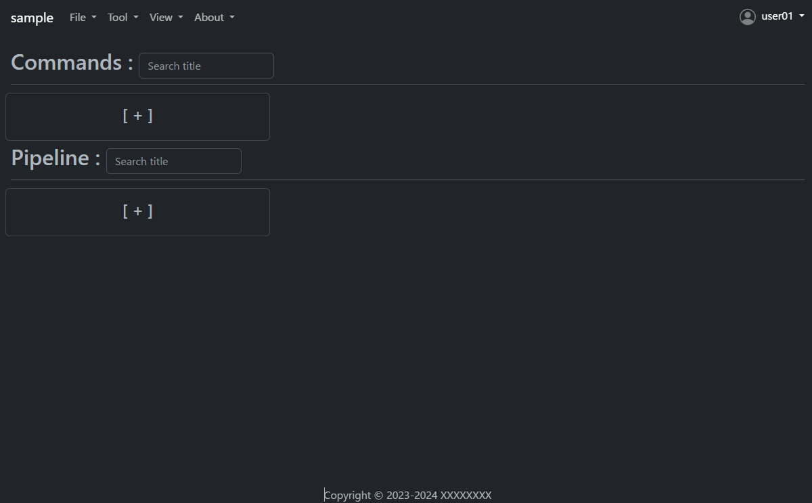
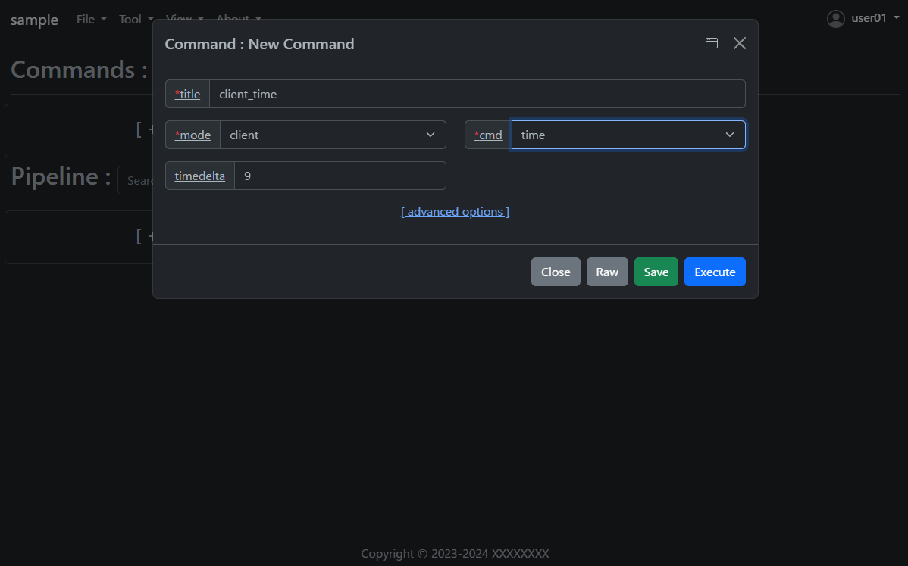
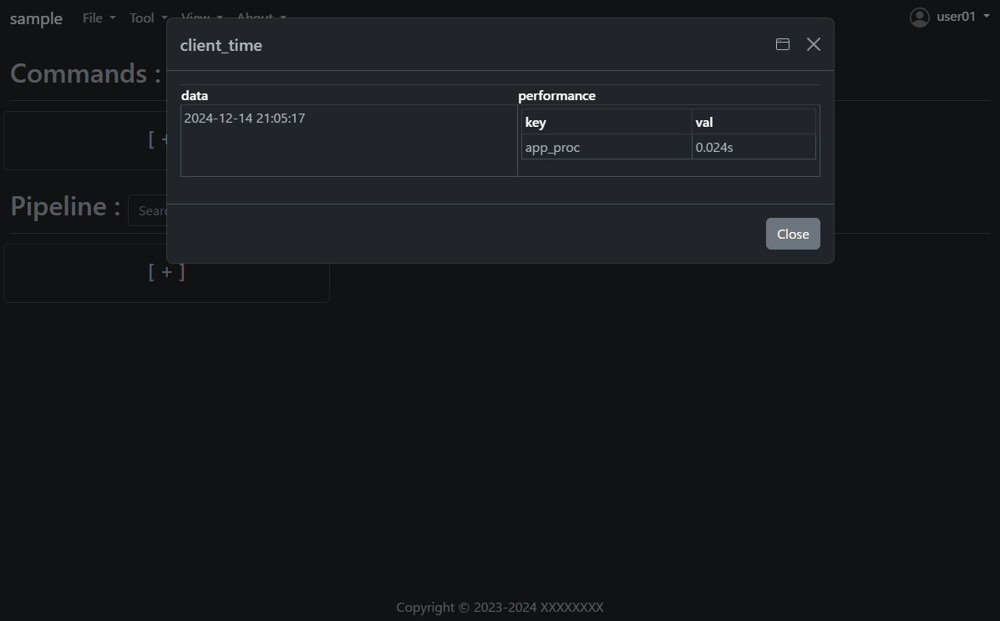
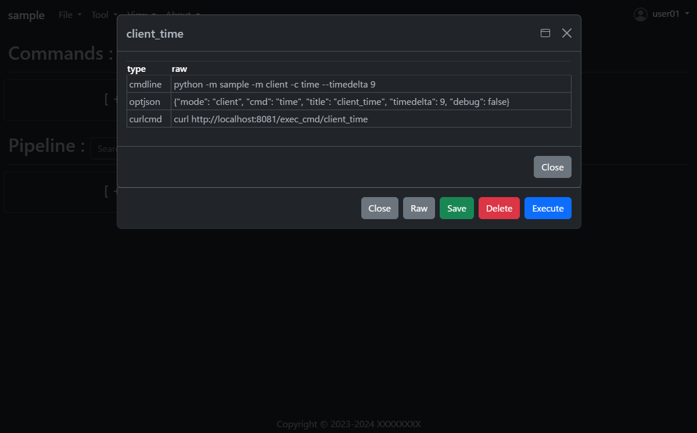

.. -*- coding: utf-8 -*-

**************
Tutorial
**************

- Open the `.sample/sample_project` folder in the current directory with VSCode.

- Install dependent libraries.

.. code-block:: bash

    python -m venv .venv
    . .venv/bin/activate
    pip install -r requirements.txt

- Run the project.

- The localhost web screen will open.

- Enter `user01 / user01` for the initial ID and PW to sign in.
- Using this web screen, you can easily execute the commands implemented in cmdbox.

- Let's look at the command to get a list of files as an example.
- Press the plus button under Commands to open the Add dialog.
- Then enter the following.

- Press the `Save` button once and then press the `Execute` button.
- The results of the command execution are displayed.

- Open the saved `client_time` and press the `Raw` button.
- You will see how to execute the same command on the command line; the RESTAPI URL is also displayed.

How to implement a new command using cmdbox
======================================================

- Under the `sample/app/features/cli` folder, you will find an implementation of the `client_time` mentioned earlier.
- The implementation is as follows. (Slightly abbreviated display)
- Create the following code and save it in the `sample/app/features/cli` folder.

.. code-block:: python

    from cmdbox.app import common, feature
    from typing import Dict, Any, Tuple, Union, List
    import argparse
    import datetime
    import logging

    class ClientTime(feature.Feature):
        def get_mode(self) -> Union[str, List[str]]:
            return "client"

        def get_cmd(self):
            return 'time'

        def get_option(self):
            return dict(
                type="str", default=None, required=False, multi=False, hide=False, use_redis=self.USE_REDIS_FALSE,
                discription_ja="クライアント側の現在時刻を表示します。",
                discription_en="Displays the current time at the client side.",
                choise=[
                    dict(opt="timedelta", type="int", default=9, required=False, multi=False, hide=False, choise=None,
                            discription_ja="時差の時間数を指定します。",
                            discription_en="Specify the number of hours of time difference."),
                ])

        def apprun(self, logger:logging.Logger, args:argparse.Namespace, tm:float, pf:List[Dict[str, float]]=[]) -> Tuple[int, Dict[str, Any], Any]:
            tz = datetime.timezone(datetime.timedelta(hours=args.timedelta))
            dt = datetime.datetime.now(tz)
            ret = dict(success=dict(data=dt.strftime('%Y-%m-%d %H:%M:%S')))
            common.print_format(ret, args.format, tm, args.output_json, args.output_json_append, pf=pf)
            if 'success' not in ret:
                return 1, ret, None
            return 0, ret, None

- Open the file `sample/extensions/features.yml`. The file should look something like this.
- This file specifies where new commands are to be read.
- For example, if you want to add a package to read, add a new `package` and `prefix` to `features.cli`.
- Note that `features.web` can be used to add a new web screen.
- If you only want to call commands added in `features.cli` via RESTAPI, no additional implementation is needed in `features.web`.

.. code-block:: yaml

    features:
    cli:
        - package: sample.app.features.cli
        prefix: sample_
    web:
        - package: sample.app.features.web
        prefix: sample_web_
    args:
    cli:
        - rule:
            mode: web
        default:
        coercion:
            assets:
            - f"{Path(self.ver.__file__).parent / 'web' / 'assets'}"
            doc_root: f"{Path(self.ver.__file__).parent / 'web'}"
        - rule:
            mode: gui
        default:
        coercion:
            assets:
            - f"{Path(self.ver.__file__).parent / 'web' / 'assets'}"
            doc_root: f"{Path(self.ver.__file__).parent / 'web'}"

- The following files should also be known when using commands on the web screen or RESTAPI.
- Open the file `sample/extensions/user_list.yml`. The file should look something like this.
- This file manages the users and groups that are allowed Web access and their rules.
- The rule of the previous command is `allow` for users in the `user` group in `cmdrule.rules`.

.. code-block:: yaml

    users:
    - uid: 1
        name: admin
        password: XXXXXXXX
        hash: plain
        groups: [admin]
    - uid: 101
        name: user01
        password: XXXXXXXX
        hash: md5
        groups: [user]
    - uid: 102
        name: user02
        password: XXXXXXXX
        hash: sha1
        groups: [readonly]
    - uid: 103
        name: user03
        password: XXXXXXXX
        hash: sha256
        groups: [editor]
    groups:
    - gid: 1
        name: admin
    - gid: 101
        name: user
    - gid: 102
        name: readonly
        parent: user
    - gid: 103
        name: editor
        parent: user
    cmdrule:
    policy: deny # allow, deny
    rules:
        - groups: [admin]
        rule: allow
        - groups: [user]
        mode: client
        cmds: [file_download, file_list, server_info, time]
        rule: allow
        - groups: [user]
        mode: server
        cmds: [list, time]
        rule: allow
        - groups: [editor]
        mode: client
        cmds: [file_copy, file_mkdir, file_move, file_remove, file_rmdir, file_upload]
        rule: allow
    pathrule:
    policy: deny # allow, deny
    rules:
        - groups: [admin]
        paths: [/]
        rule: allow
        - groups: [user]
        paths: [/signin, /assets, /bbforce_cmd, /copyright, /dosignin, /dosignout,
                /exec_cmd, /exec_pipe, /filer, /gui, /get_server_opt, /usesignout, /versions_cmdbox, /versions_used, /versions_sample]
        rule: allow
        - groups: [readonly]
        paths: [/gui/del_cmd, /gui/del_pipe, /gui/save_cmd, /gui/save_pipe]
        rule: deny
        - groups: [editor]
        paths: [/gui/del_cmd, /gui/del_pipe, /gui/save_cmd, /gui/save_pipe]
        rule: allow

