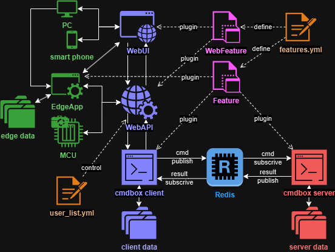

.. -*- coding: utf-8 -*-

#######################################
cmdbox
#######################################

- It is a command development application with a plugin mechanism.
- With cmdbox, you can easily implement commands with complex options.
- The implemented commands can be called from the CLI / RESTAPI / Web / Edge screen.
- The implemented commands can be executed on a remote server via redis.

.. toctree::
   :maxdepth: 2

   Install <docs/install.rst>
   Tutorial <docs/tutorial.rst>
   Command Reference <docs/command.rst>
   Features <docs/features.rst>
   Authentication <docs/authentication.rst>
   Developer Information <docs/developer.rst>
   Common Errors <docs/errors.rst>
   License <docs/license.rst>

Indices and tables
==================

* :ref:`genindex`
* :ref:`modindex`
